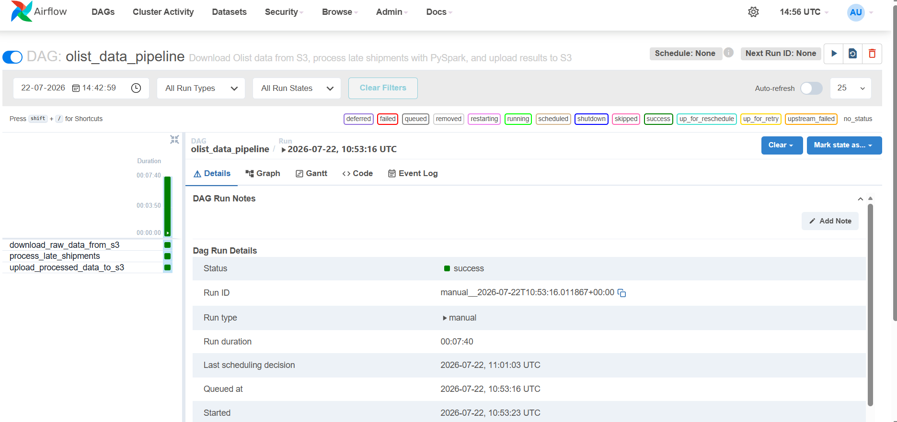
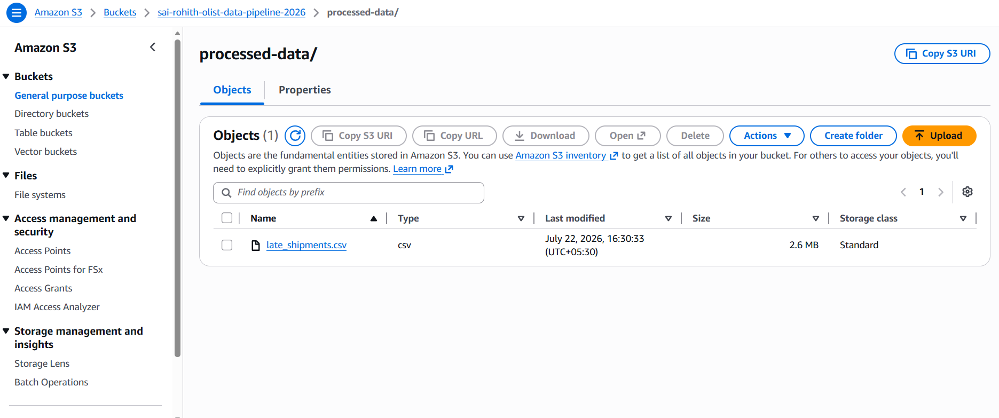
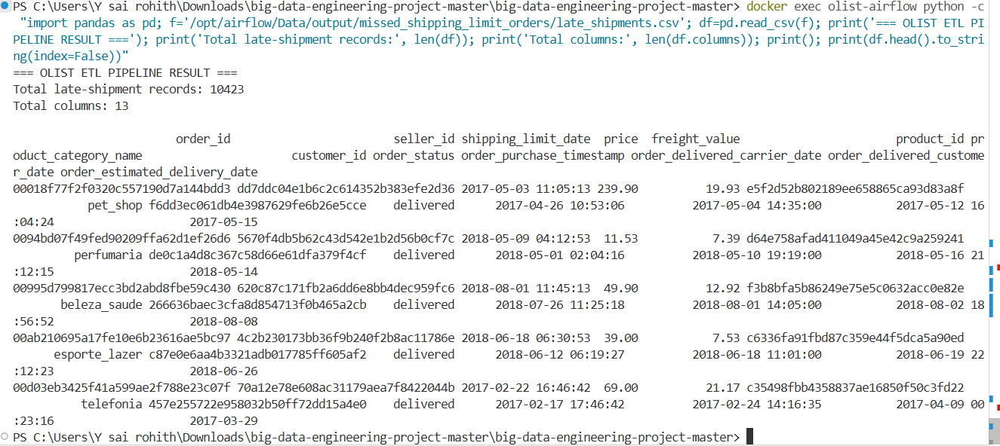

# Olist Big Data Engineering ETL Pipeline

### End-to-End Cloud Data Pipeline for E-Commerce Logistics Analytics

**AWS S3 | Apache Airflow | PySpark | Spark SQL | Docker | Python**


---

## About This Project

This project implements an **end-to-end data engineering ETL pipeline** using Apache Airflow, PySpark, Spark SQL, AWS S3, Docker, Python, Pandas, and Boto3.

The pipeline processes the Brazilian Olist E-Commerce dataset to identify orders where sellers handed packages to the carrier **after the required shipping deadline**.

The workflow automates the complete data lifecycle:

```text
AWS S3 Raw Data
      |
      v
Python + Boto3
      |
      v
Apache Airflow
      |
      v
PySpark + Spark SQL
      |
      v
Late Shipment Analysis
      |
      v
AWS S3 Processed Data
```

The successfully executed pipeline produced an analytics-ready dataset containing **10,423 late-shipment records across 13 columns**.

---

## Key Results

| Metric | Result |
|---|---:|
| Late-shipment records identified | **10,423** |
| Final output columns | **13** |
| Automated Airflow tasks | **3** |
| Cloud storage | **AWS S3** |
| Processing engine | **PySpark / Apache Spark** |
| Final output | **late_shipments.csv** |
| Pipeline status | **SUCCESS** |

---

## Data Pipeline Architecture

```text
+----------------------------+
|   Olist E-Commerce Data    |
+-------------+--------------+
              |
              v
+----------------------------+
|          AWS S3            |
|          RAW LAYER         |
|          raw-data/         |
+-------------+--------------+
              |
              | Python + Boto3
              v
+----------------------------+
|       Apache Airflow       |
|    Workflow Orchestration  |
+-------------+--------------+
              |
              v
+----------------------------+
|          PySpark           |
|        + Spark SQL         |
|                            |
|   Load - Join - Transform  |
|          - Filter          |
+-------------+--------------+
              |
              v
+----------------------------+
|    Late Shipment Analysis  |
|                            |
|      10,423 Records        |
|        13 Columns          |
+-------------+--------------+
              |
              | Python + Boto3
              v
+----------------------------+
|          AWS S3            |
|      PROCESSED LAYER       |
|                            |
| processed-data/            |
| late_shipments.csv         |
+----------------------------+
```

### End-to-End Flow

```text
Olist Dataset
      |
      v
AWS S3 - Raw Layer
      |
      v
Python + Boto3
      |
      v
Apache Airflow
      |
      v
PySpark + Spark SQL
      |
      v
Late Shipment Analysis
      |
      v
AWS S3 - Processed Layer
```

---

## Apache Airflow Orchestration

The ETL workflow is orchestrated using Apache Airflow.

The pipeline consists of three dependent stages:

```text
download_raw_data_from_s3
            |
            v
process_late_shipments
            |
            v
upload_processed_data_to_s3
```

### Pipeline Execution

```text
DOWNLOAD RAW DATA          SUCCESS
        |
        v
PROCESS LATE SHIPMENTS     SUCCESS
        |
        v
UPLOAD PROCESSED DATA      SUCCESS
```

Airflow manages task dependencies so each stage runs only after the previous stage completes successfully.

---

# Project in Action

## 1. Apache Airflow - Successful Pipeline Execution

The complete pipeline executed successfully with all three ETL tasks reaching the success state.



### What this demonstrates

- Airflow DAG orchestration
- Task dependency management
- Successful S3 data ingestion
- Successful PySpark processing
- Successful processed-data upload
- End-to-end pipeline completion

---

## 2. AWS S3 - Processed Data Output

The transformed dataset was successfully uploaded to the AWS S3 processed-data layer.



Final cloud output:

```text
processed-data/
    late_shipments.csv
```

This verifies successful integration between the ETL pipeline and AWS S3.

---

## 3. Final ETL Results

The final processed dataset contains **10,423 late-shipment records and 13 columns**.



```text
Total Records:  10,423
Total Columns:  13
Output:         late_shipments.csv
Status:         Successfully Processed
```

---

# Technology Stack

| Category | Technologies |
|---|---|
| Programming | **Python** |
| Big Data Processing | **PySpark, Apache Spark** |
| Data Transformation | **Spark SQL** |
| Workflow Orchestration | **Apache Airflow** |
| Cloud Storage | **AWS S3** |
| AWS Integration | **Boto3** |
| Data Handling | **Pandas** |
| Containerization | **Docker, Docker Compose** |
| Runtime | **Java 17** |
| Version Control | **Git, GitHub** |

---

# How the ETL Pipeline Works

## 1. Extract - Download Raw Data from AWS S3

The source Olist datasets are stored in the AWS S3 raw-data layer.

```text
AWS S3
|
+-- raw-data/
    |
    +-- olist_customers_dataset.csv
    +-- olist_geolocation_dataset.csv
    +-- olist_order_items_dataset.csv
    +-- olist_order_payments_dataset.csv
    +-- olist_order_reviews_dataset.csv
    +-- olist_orders_dataset.csv
    +-- olist_products_dataset.csv
    +-- olist_sellers_dataset.csv
    +-- product_category_name_translation.csv
```

Python and Boto3 are used to retrieve the required datasets from AWS S3.

```text
AWS S3
   |
   v
Boto3
   |
   v
Processing Environment
```

---

## 2. Transform - Process Data with PySpark

PySpark provides the data-processing engine for the transformation stage.

The main transformation works with Olist datasets containing:

- Order information
- Order-item information
- Product information
- Seller information
- Customer information
- Shipping deadlines
- Carrier delivery timestamps
- Product categories
- Price and freight information

Spark DataFrames are used to load and process the data.

---

## 3. Analyze - Spark SQL

Spark SQL is used for data joins, transformations, and business-rule filtering.

The primary business condition used to identify late seller-to-carrier shipments is:

```sql
shipping_limit_date < order_delivered_carrier_date
```

In simple terms:

```text
Required Shipping Deadline
            <
Actual Handover to Carrier
```

If this condition is true, the seller handed the package to the carrier after the required shipping deadline.

---

## 4. Load - Publish Processed Data to AWS S3

After transformation, the pipeline generates:

```text
late_shipments.csv
```

The processed file is uploaded using Python and Boto3:

```text
PySpark Output
      |
      v
late_shipments.csv
      |
      v
Python + Boto3
      |
      v
AWS S3
      |
      v
processed-data/late_shipments.csv
```

This completes the ETL workflow.

---

# AWS S3 Data Organization

The project separates source data and transformed data into raw and processed layers.

```text
AWS S3 Bucket
|
+-- raw-data/
|   |
|   +-- olist_customers_dataset.csv
|   +-- olist_geolocation_dataset.csv
|   +-- olist_order_items_dataset.csv
|   +-- olist_order_payments_dataset.csv
|   +-- olist_order_reviews_dataset.csv
|   +-- olist_orders_dataset.csv
|   +-- olist_products_dataset.csv
|   +-- olist_sellers_dataset.csv
|   +-- product_category_name_translation.csv
|
+-- processed-data/
    |
    +-- late_shipments.csv
```

### Data Layer Design

```text
RAW DATA                                 PROCESSED DATA

raw-data/                                processed-data/
    |                                         ^
    |                                         |
    +----> AIRFLOW ----> PYSPARK ----> SQL ---+
```

---

# Final Dataset Schema

The final processed dataset contains **13 columns**.

| # | Column | Description |
|---:|---|---|
| 1 | `order_id` | Unique order identifier |
| 2 | `seller_id` | Seller identifier |
| 3 | `shipping_limit_date` | Required seller shipping deadline |
| 4 | `price` | Product price |
| 5 | `freight_value` | Freight value |
| 6 | `product_id` | Product identifier |
| 7 | `product_category_name` | Product category |
| 8 | `customer_id` | Customer identifier |
| 9 | `order_status` | Order status |
| 10 | `order_purchase_timestamp` | Order purchase timestamp |
| 11 | `order_delivered_carrier_date` | Date handed to carrier |
| 12 | `order_delivered_customer_date` | Customer delivery date |
| 13 | `order_estimated_delivery_date` | Estimated delivery date |

---

# Project Structure

```text
olist-big-data-etl-pipeline/
|
+-- airflow/
|   |
|   +-- dags/
|   |   |
|   |   +-- late_shipments_to_carrier_dag.py
|   |
|   +-- scripts/
|       |
|       +-- s3_download.py
|       +-- spark_missed_deadline_job.py
|       +-- s3_upload.py
|
+-- screenshots/
|   |
|   +-- airflow-dag-success.png
|   +-- etl-results.png
|   +-- s3-processed-output.png
|
+-- Dockerfile
+-- docker-compose.yaml
+-- .gitignore
+-- README.md
```

Large local datasets, generated outputs, credentials, and environment-specific files are excluded from version control.

---

# Dockerized Environment

The data engineering environment is containerized using Docker.

### Environment Components

```text
Apache Airflow 2.10.5
Python 3.11
Java 17
PySpark
Apache Spark
Spark SQL
Pandas
Boto3
```

### Why Docker?

Docker provides:

- Consistent development environment
- Dependency isolation
- Reproducible project setup
- Integrated Python, Java, Spark, and Airflow environment
- Easier local deployment

---

# Running the Project

## Prerequisites

Install:

```text
Docker Desktop
AWS CLI
Git
```

You also need:

```text
AWS Account
AWS S3 Bucket
Configured AWS Credentials
Olist Dataset
```

---

## Step 1 - Clone the Repository

```bash
git clone https://github.com/Rohith4-sai/olist-big-data-etl-pipeline.git
```

Enter the project directory:

```bash
cd olist-big-data-etl-pipeline
```

---

## Step 2 - Configure AWS Credentials

Configure AWS locally:

```bash
aws configure
```

Provide the required AWS configuration when prompted.

AWS credentials should never be hard-coded into source files or committed to GitHub.

---

## Step 3 - Prepare the S3 Raw Data Layer

Upload the Olist CSV datasets into the S3 raw-data prefix.

```text
your-s3-bucket/
|
+-- raw-data/
    |
    +-- olist_orders_dataset.csv
    +-- olist_order_items_dataset.csv
    +-- olist_products_dataset.csv
    +-- ...
```

---

## Step 4 - Build the Docker Image

```bash
docker compose build
```

---

## Step 5 - Start the Environment

```bash
docker compose up -d
```

Verify the running container:

```bash
docker ps
```

---

## Step 6 - Verify the Airflow Scheduler

```bash
docker exec olist-airflow airflow jobs check --job-type SchedulerJob
```

Expected result:

```text
Found one alive job.
```

---

## Step 7 - Open Apache Airflow

Open the Airflow web interface:

```text
http://localhost:8080
```

Locate the project DAG, enable it, and trigger a new run.

---

## Step 8 - Monitor Pipeline Execution

The workflow executes:

```text
S3 DOWNLOAD
     |
     v
PYSPARK + SPARK SQL PROCESSING
     |
     v
S3 UPLOAD
```

Wait until all three tasks reach the success state.

---

## Step 9 - Verify the Final Output

The processed file should be available in AWS S3:

```text
processed-data/late_shipments.csv
```

Verified project result:

```text
Rows:     10,423
Columns:  13
```

---

# Data Engineering Skills Demonstrated

### Data Engineering

- End-to-end ETL pipeline development
- Data ingestion and transformation
- Multi-dataset integration
- Business-rule filtering
- Raw and processed data-layer design
- Analytics-ready dataset generation

### Big Data Processing

- PySpark
- Apache Spark
- Spark DataFrames
- Spark SQL
- Multi-table transformations

### Workflow Orchestration

- Apache Airflow
- DAG development
- Task dependencies
- Pipeline execution monitoring

### Cloud

- AWS S3
- Boto3
- Cloud-based raw and processed data storage

### DevOps

- Docker
- Docker Compose
- Containerized data engineering environment

### Software Engineering

- Python
- Git
- GitHub
- Modular pipeline scripts
- Environment configuration

---

# Security Practices

Sensitive credentials and local environment files are excluded from version control.

The `.gitignore` excludes files and directories such as:

```text
.env
.env.*
*.pem
*.key

.aws/
credentials

airflow.db
*.db
standalone_admin_password.txt
logs/
airflow/logs/

Data/

.venv/
venv/
```

AWS credentials are configured locally instead of being hard-coded into the project source code.

---

# Business Value

Late handover of packages to logistics carriers can contribute to:

- Delivery delays
- Poor customer experience
- Increased customer complaints
- Lower seller performance
- Logistics inefficiencies

The processed dataset can support further analysis such as:

```text
Which sellers frequently miss shipping deadlines?

Which product categories experience more late shipments?

How much order value is associated with late shipments?

Are certain periods associated with higher shipping delays?

How does late carrier handover relate to final customer delivery?
```

---

# Project Highlights

| Feature | Implementation |
|---|---|
| Data ingestion | **AWS S3 + Boto3** |
| Workflow orchestration | **Apache Airflow** |
| Distributed processing | **PySpark / Apache Spark** |
| SQL transformation | **Spark SQL** |
| Cloud storage | **AWS S3** |
| Containerization | **Docker** |
| Processed output | **10,423 records** |
| Output schema | **13 columns** |
| Automated pipeline stages | **3 tasks** |
| Pipeline status | **Successfully Executed** |

---

# Future Enhancements

Possible extensions include:

- Use PostgreSQL for production-grade Airflow metadata storage
- Store processed datasets in Parquet format
- Add automated data-quality checks
- Add AWS Glue Data Catalog integration
- Query processed datasets using Amazon Athena
- Run distributed Spark workloads using AWS EMR
- Implement incremental ETL processing
- Add pipeline monitoring and failure notifications
- Partition processed datasets for efficient analytics
- Build logistics analytics dashboards
- Add CI/CD for testing and deployment

---

# Final Outcome

```text
OLIST E-COMMERCE DATA
          |
          v
AWS S3 RAW LAYER
          |
          v
PYTHON + BOTO3
          |
          v
APACHE AIRFLOW
          |
          v
PYSPARK + SPARK SQL
          |
          v
LOGISTICS TRANSFORMATION
          |
          v
10,423 LATE-SHIPMENT RECORDS
13 OUTPUT COLUMNS
          |
          v
AWS S3 PROCESSED LAYER
          |
          v
PIPELINE SUCCESS
```

---

## Olist Big Data Engineering ETL Pipeline

A hands-on data engineering project demonstrating an end-to-end workflow across **cloud storage, workflow orchestration, distributed data processing, SQL transformation, and containerization**.

**Core Technologies:** Python | PySpark | Apache Spark | Spark SQL | Apache Airflow | AWS S3 | Boto3 | Docker | Git